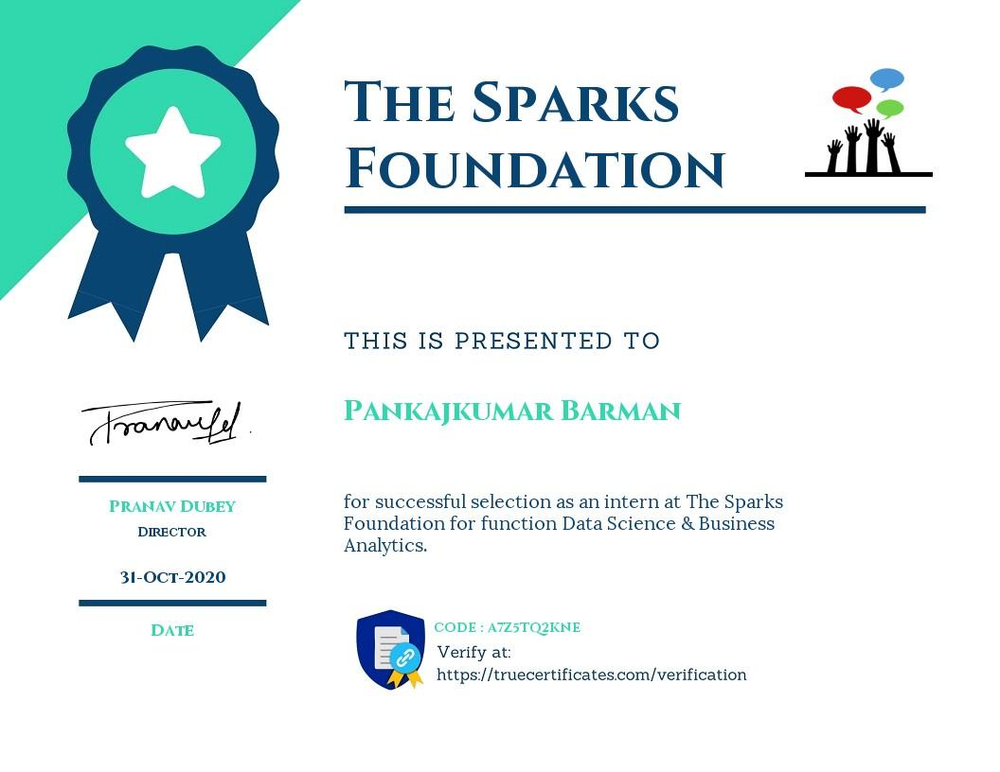
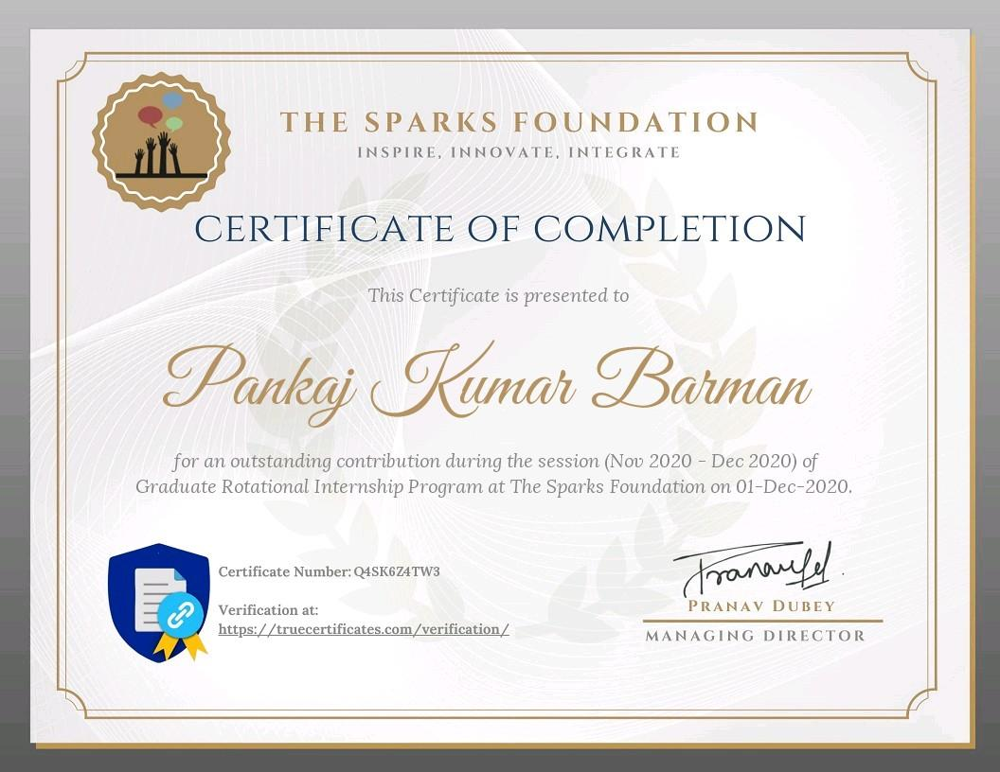

# GRIP Internship — Data Science & Business Analytics

**The Sparks Foundation | Graduate Rotational Internship Program (GRIP)**
**Intern:** Pankaj Kumar Barman
**Track:** Data Science & Business Analytics
**Session:** November 2020 – December 2020

This repository contains all the tasks completed as part of the Graduate Rotational Internship Program (GRIP) offered by **The Sparks Foundation**. Each task is implemented as a self-contained Jupyter Notebook covering a different area of the Data Science workflow — from supervised and unsupervised machine learning to exploratory data analysis and decision tree classification.

---

## 📁 Repository Structure

| File | Task | Type |
|---|---|---|
| `Task_01.ipynb` | Prediction using Supervised ML (Linear Regression) | Minor Project |
| `Task_02.ipynb` | Prediction using Unsupervised ML (K-Means Clustering) | Minor Project |
| `Task_3.ipynb`  | Exploratory Data Analysis — Retail | Minor Project |
| `Task_06.ipynb` | Prediction using Decision Tree Algorithm | Major Project |

---

## 📌 Task 1 — Prediction Using Supervised ML (Linear Regression)

**Objective:** Predict the percentage of a student's score based on the number of hours they study, and estimate the score for a student who studies 9.25 hrs/day.

**Approach:**
- Loaded the student study-hours vs. scores dataset directly from a public CSV link.
- Performed basic EDA — checked for null values, data shape, and summary statistics.
- Visualized the relationship between study hours and scores using scatter and bar plots, confirming a linear trend.
- Split the data into training and test sets (80/20).
- Trained a **Linear Regression** model using `scikit-learn`.
- Plotted the regression line against both training and test data.
- Evaluated the model using **MAE**, **MSE**, and **RMSE**.
- Additionally experimented with feature scaling (`StandardScaler`) and **Ridge Regression with GridSearchCV** to see if performance could be improved.

**Key Result:**
> A student who studies for **9.25 hrs/day** is predicted to score approximately **93.69%**.

**Conclusion:** Scaling the data caused the model to overfit, while Ridge Regression with GridSearchCV led to underfitting. The simple **Linear Regression** model was found to be the best fit for this dataset.

**Libraries used:** `pandas`, `numpy`, `matplotlib`, `seaborn`, `scikit-learn`

---

## 📌 Task 2 — Prediction Using Unsupervised ML (K-Means Clustering)

**Objective:** Using the Iris dataset, predict the optimal number of clusters and represent them visually — without using the label information.

**Approach:**
- Loaded and explored the Iris dataset (shape, data types, summary statistics).
- Checked for missing values and outliers (boxplots for each feature) and visualized feature correlations using a heatmap.
- Used the **Elbow Method** (plotting WCSS — Within Cluster Sum of Squares — against the number of clusters) to determine the optimal number of clusters.
- Applied **K-Means clustering** with the optimal cluster count.
- Visualized the resulting clusters along with their centroids on a scatter plot.

**Key Result:**
> The Elbow Method identified **3** as the optimal number of clusters — matching the three actual Iris species (*Iris-setosa*, *Iris-versicolor*, *Iris-virginica*), even though the model was never given the species labels.

**Libraries used:** `pandas`, `numpy`, `matplotlib`, `seaborn`, `scikit-learn` (`KMeans`)

---

## 📌 Task 3 — Exploratory Data Analysis (EDA) on Retail Data

**Objective:** Acting as a business analyst, explore the Sample Superstore dataset to identify weak-performing areas and uncover actionable business insights to improve profitability.

**Approach:**
- Performed a full data-characteristics audit — column types, nulls, duplicates, and outliers (boxplots for Sales, Profit, Quantity, Discount, Postal Code).
- Removed duplicate records and visualized missing-value patterns.
- Built a correlation heatmap and pairplot to understand relationships between numerical features.
- Analyzed Sales & Profit distribution across **Segment, Category, Sub-Category, State, City, and Region** using bar plots, pie charts, and count plots.
- Identified the top 10 most profitable cities and states.
- Studied the relationship between Sales and Profit using a regression plot.

**Key Insights:**
- The **West** region generates the highest profit; the **Central/South** regions comparatively underperform.
- **California** is the most profitable state, while **Texas** shows losses.
- **New York City** delivers the highest profit; **Philadelphia** the lowest.
- Sales and Profit show a clear **positive correlation** — as sales increase, profit tends to increase too, though some high-sales sub-categories still report losses due to heavy discounting.

**Conclusion:** The business should focus on improving performance in low/negative-profit states and regions (e.g., Texas, Central region) while continuing to capitalize on strong-performing regions like the West.

**Libraries used:** `pandas`, `numpy`, `matplotlib`, `seaborn`, `cufflinks`, `plotly`

---

## 📌 Task 6 — Prediction Using Decision Tree Algorithm (Major Project)

**Objective:** Build a Decision Tree classifier on the Iris dataset and visualize it graphically, such that it can accurately classify the species of a new, unseen flower sample.

**Approach:**
- Loaded and explored the Iris dataset — data types, statistics, correlations, and missing values.
- Performed feature engineering: label-encoded the target `Species` column (`Iris-setosa` → 0, `Iris-versicolor` → 1, `Iris-virginica` → 2).
- Split the data into training and test sets.
- Trained a **Decision Tree Classifier** using `scikit-learn`.
- Visualized the trained tree graphically using `export_graphviz` and `pydotplus`.
- Evaluated the model with training/test accuracy scores, a **confusion matrix**, and a **classification report**.
- Tested the model by feeding it new, unseen data points to confirm correct class prediction.

**Key Result:**
> The classifier achieved strong training and test accuracy and **correctly predicted the class of new/unseen samples**, confirming the model generalizes well.

**Libraries used:** `pandas`, `numpy`, `matplotlib`, `seaborn`, `scikit-learn` (`DecisionTreeClassifier`), `pydotplus`, `graphviz`

---

## 🛠️ Tech Stack

- **Language:** Python 3
- **Environment:** Jupyter Notebook / Google Colab
- **Core Libraries:** `pandas`, `numpy`, `matplotlib`, `seaborn`, `scikit-learn`, `plotly`, `cufflinks`, `pydotplus`

## ▶️ How to Run

1. Clone this repository:
   ```bash
   git clone https://github.com/573-pankaj/GRIP-internship-task.git
   cd GRIP-internship-task
   ```
2. Install the required dependencies:
   ```bash
   pip install pandas numpy matplotlib seaborn scikit-learn plotly cufflinks pydotplus
   ```
3. Open any notebook in Jupyter or upload it to Google Colab:
   ```bash
   jupyter notebook "Task_01.ipynb"
   ```
   > Note: Task 2, Task 3, and Task 6 expect their respective dataset files (`iris.csv`, `SampleSuperstore.csv`, `Iris.csv`) to be present in the working directory (or uploaded via Colab, as in Task 6).

---

## 🏅 Internship Certification

Successfully completed the **Graduate Rotational Internship Program (GRIP)** in **Data Science & Business Analytics** at **The Sparks Foundation**, spanning the **November 2020 – December 2020** session.

<p align="center">
  
  &nbsp;&nbsp;
  
</p>

- **Certificate of Completion Number:** `Q4SK6Z4TW3`
- **Offer Verification Code:** `A7Z5TQ2KNE`
- **Verify at:** [truecertificates.com/verification](https://truecertificates.com/verification/)

> 💡 Add your certificate image files (`certificate_offer.png` and `certificate_completion.png`) to the root of this repository so they render correctly in the README above.

---

## 🔗 Additional Links

- **LinkedIn Posts:** Task write-ups and demo videos for each project were shared on [LinkedIn](https://www.linkedin.com/in/pankaj-kumar-barman-5a66761a7/).
- **YouTube:** Walkthrough videos accompany each task submission.

---

## 👤 Author

**Pankaj Kumar Barman**
Data Science & Business Analytics Intern, The Sparks Foundation (GRIP Nov 2020)
